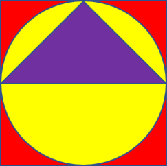

# Menghitung Luas

<p align="center">
  
</p>

Kamu adalah seorang kontraktor yang sedang membantu pembangunanlapangan untuk sebuah sekolah lokal yang kepala sekolahnya bernama Pak
Chanek.

Pak Chanek ingin logo di atas dilukiskan pada berbagai bagian di sekitarlapangan. Logo tersebut terdiri dari sebuah persegi berwarna merah di latar palingluar, bentuk lingkaran berwarna kuning di tengah, dan segitiga berwarna ungu di paling dalam.

Untuk menghitung anggaran, beliau perlu tahu berapa banyak cat yang akan digunakan untuk melukis logo tersebut.

Kamu ditugaskan untuk membuat sebuah program yang dapat menghitung luas daerah yang dicat masing-masing warna berdasarkan radius (jari-jari) lingkaran tersebut. Ingat bahwa luas daerah yang dicat belum tentu sama dengan luas daerah total bentukmasing-masing.

Dengan demikian, Pak Chanek dapat mengestimasi seberapa banyak cat yang dibutuhkan.

## Informasi Tambahan

-   Tinggi segitiga = r

Dengan 𝑟 = radius (jari-jari) dari lingkaran kuning.

Untuk nilai π, silahkan menggunakan standard library math Python, dengan contoh sebagai berikut:

```py
import math

# menghitung nilai pi * 2
pi_kali_dua = math.pi * 2
print(pi_kali_dua)
```

Output:

```
6.283185307179586
```

Selengkapnya dapat dilihat di link berikut:
https://docs.python.org/3/library/math.html#constants

## Spesifikasi Program

**Input:** Sebuah bilangan riil (int maupun float) `n`, dengan `0 <= n`
**Output:** 3 bilangan `float` dengan 2 digit di belakang koma yang merepresentasikan luas daerah yang dicat merah, kuning, dan ungu

## Test Cases

Input:

```
Masukkan radius lingkaran: 42
```

Output

```
Luas daerah cat merah: 1514.23
Luas daerah cat kuning: 3777.77
Luas daerah cat ungu: 1764.00
```

---

Input:

```
Masukkan radius lingkaran: 36
```

Output:

```
Luas daerah cat merah: 1112.50
Luas daerah cat kuning: 2775.50
Luas daerah cat ungu: 1296.00

```

---

Input:

```
Masukkan radius lingkaran: 96.024
```

Output:

```
Luas daerah cat merah: 7915.04
Luas daerah cat kuning: 19746.79
Luas daerah cat ungu: 9220.61
```

---

Input:

```
Masukkan radius lingkaran: 0
```

Output:

```
Luas daerah cat merah: 0.00
Luas daerah cat kuning: 0.00
Luas daerah cat ungu: 0.00
```

---

Input:

```
Masukkan radius lingkaran: 10000006.99
```

Output:

```
Luas daerah cat merah: 85840854646409.69
Luas daerah cat kuning: 214159564753736.88
Luas daerah cat ungu: 100000139800048.86
```

**Catatan:** Jangan khawatir jika output program kamu berbeda nilainya dengan contoh output selama perbedaannya lumayan wajar.

---

Adapted from `Lab01.pdf`. Problem made by PAN, FHZ, KD, BPK, CR.
