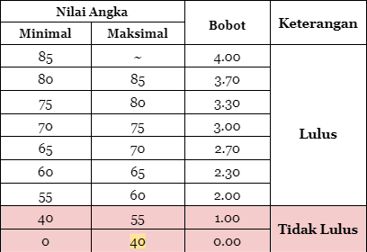

# Menghitung IPK

Dek Depe akhirnya berhasil melalui semester pertamanya di Fasilkom! Hore! Setelah berjerih payah selama satu semester, Dek Depe mendapatkan nilai akhir untuk semua mata kuliah yang dia ambil semester ini. Namun, Dek Depe merasa kesulitan jika harus menghitung satu per satu untuk mengetahui IPK (Indeks Prestasi Kumulatif) dan IPT (Indeks Prestasi Total) yang dia dapatkan ~~karena Dek Depe tidak tahu ada halaman Ringkasan~~.

Bantulah Dek Depe menghitung IPK dan IPT-nya!

## Spesifikasi Program

-   Program meminta input banyaknya mata kuliah yang Dek Depe ambil pada Semester 1 ini. Jumlah mata kuliah yang diambil tidak boleh negatif. Apabila Dek Depe menginput nilai negatif, program akan terus meminta nilai angka mata kuliah tersebut sampai jumlah yang dimasukkan valid.
-   Program meminta masukan nama mata kuliah, jumlah SKS, dan nilai angka yang didapatkan Dek Depe pada mata kuliah tersebut.
-   Nilai angka yang didapatkan Dek Depe tidak boleh negatif. Apabila Dek Depe menginput nilai negatif, program akan terus meminta nilai angka mata kuliah tersebut sampai nilai yang dimasukkan valid.
-   Program akan mencetak jumlah SKS lulus, jumlah mutu lulus, IPK, dan IPT Dek Depe. Tampilkan jumlah mutu lulus, IPK dan IPT dengan dua angka di belakang koma.
-   Perhitungan total mutu mengikuti tabel berikut. Minimal <= Nilai < Maksimal.

<p align="center">
  
</p>

-   Rumus perhitungan IPK adalah sebagai berikut.

<p align="center">
  
</p>

-   Rumus perhitungan IPT adalah sebagai berikut.

<p align="center">
  
</p>

> Perhatikan bahwa IPT memperhitungkan mata kuliah yang lulus dan tidak lulus, sementara IPK hanya memperhitungkan mata kuliah yang lulus.

## Test Cases

Input:

```
Selamat datang di Kalkulator IPK!
Masukkan jumlah mata kuliah: 4

Masukkan nama mata kuliah ke-1: MATDIS 1
Masukkan jumlah SKS MATDIS 1: 3
Masukkan nilai yang kamu dapatkan: 73

Masukkan nama mata kuliah ke-2 : DDP1
Masukkan jumlah SKS DDP1: 4
Masukkan nilai yang kamu dapatkan: 78

Masukkan nama mata kuliah ke-3: PSD
Masukkan jumlah SKS PSD: 4
Masukkan nilai yang kamu dapatkan: 64

Masukkan nama mata kuliah ke-4: Agama
Masukkan jumlah SKS Agama: 4
Masukkan nilai yang kamu dapatkan: 59
```

Output:

```
Jumlah SKS lulus : 15 / 15
Jumlah mutu lulus: 39.40 / 39.40
Total IPK kamu adalah 2.63
Total IPT kamu adalah 2.63
```

---

Input:

```
Selamat datang di Kalkulator IPK!
Masukkan jumlah mata kuliah: 2

Masukkan nama mata kuliah ke-1: ddp
Masukkan jumlah SKS ddp: 4
Masukkan nilai yang kamu dapatkan: 96

Masukkan nama mata kuliah ke-2: md2
Masukkan jumlah SKS md2: 3
Masukkan nilai yang kamu dapatkan: 49
```

Output:

```
Jumlah SKS lulus : 4 / 7
Jumlah mutu lulus: 16.00 / 19.00
Total IPK kamu adalah 4.00
Total IPT kamu adalah 2.71

```

---

Input:

```
Selamat datang di Kalkulator IPK!
Masukkan jumlah mata kuliah: 7

Masukkan nama mata kuliah ke-1: DDP1
Masukkan jumlah SKS DDP1: 4
Masukkan nilai yang kamu dapatkan: 89.83

Masukkan nama mata kuliah ke-2: KALKULUS1
Masukkan jumlah SKS KALKULUS1: 3
Masukkan nilai yang kamu dapatkan: -95
Nilai yang kamu masukkan tidak valid
Masukan nilai yang kamu dapatkan: -95.1
Nilai yang kamu masukkan tidak valid
Masukan nilai yang kamu dapatkan: 92

Masukkan nama mata kuliah ke-3: KOMBISTEK
Masukkan jumlah SKS KOMBISTEK: 3
Masukkan nilai yang kamu dapatkan: -20
Nilai yang kamu masukkan tidak valid
Masukan nilai yang kamu dapatkan: 54.99

Masukkan nama mata kuliah ke-4: MANBIS
Masukkan jumlah SKS MANBIS: 3
Masukkan nilai yang kamu dapatkan: 89.89

Masukkan nama mata kuliah ke-5: MATDIS1
Masukkan jumlah SKS MATDIS1: 3
Masukkan nilai yang kamu dapatkan: 80

Masukkan nama mata kuliah ke-6: AGAMA
Masukkan jumlah SKS AGAMA: 2
Masukkan nilai yang kamu dapatkan: 75

Masukkan nama mata kuliah ke-7: MPK ING
Masukkan jumlah SKS MPK ING: 2
Masukkan nilai yang kamu dapatkan: 68
```

Output:

```
Jumlah SKS lulus : 17 / 20
Jumlah mutu lulus: 63.10 / 66.10
Total IPK kamu adalah 3.71
Total IPT kamu adalah 3.31
```

---

Additional test cases is available [here](./test_cases.txt).  
Adapted from `Lab02.pdf`. Problem made by ABI, AL, BIG, MLW, LIT🔥.
