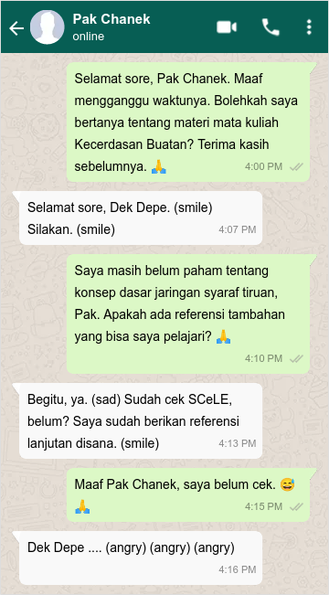

# WhatsMood AI

<p align="center">
    
</p>

Dek Depe sedang belajar beberapa materi di Mata Kuliah Kecerdasan Buatan.

Dek Depe bingung dan berencana bertanya kepada Pak Chanek melalui WhatsApp.

Pak Chanek adalah seorang dosen yang suka menggunakan emoticon saat chat.

Sayangnya, ponsel Dek Depe yang jadul tidak dapat menampilkan emoticon yang dikirimkan oleh Pak Chanek. Dek Depe hanya dapat melihat keyword emoticon yang dikirimkan oleh Pak Chanek melalui ponselnya.

Untuk menguji pemahamannya saat ini, Dek Depe ingin membuat sebuah program kecerdasan buatan yang dapat mengukur suasana hati Pak Chanek berdasarkan pesan-pesan yang dikirimkan oleh Pak Chanek kepadanya.

Namun, Dek Depe juga mempunyai banyak tugas yang harus dikerjakan dalam waktu dekat. Oleh karena itu, Dek Depe meminta tolong kepada kalian sebagai sahabat dekatnya yang baik hati. Bantulah Dek Depe untuk membuat purwarupa dari program yang diinginkannya!

# Spesifikasi Program

Dalam program tersebut terdapat tiga aspek mood yang disajikan dalam bentuk poin yaitu Happiness, Sadness, dan Anger. Setiap aspek mood memiliki initial value sebagai berikut.

1. Happiness: 50
2. Sadness: 50
3. Anger: 50

Program menerima input file berisi percakapan antara Dek Depe dan Pak Chanek. Jika file tidak ada, cetak di terminal `File input tidak ada :(`. Jika file ada tapi isinya kosong (tidak mengandung karakter apapun), cetak di terminal `File input ada tapi kosong :(`.

Kemudian, ubahlah semua keyword emoticon dalam file tersebut menjadi emoticon dengan ketentuan sebagai berikut.

1. (smile) diubah menjadi \U0001f603
2. (sad) diubah menjadi \U0001f622
3. (angry) diubah menjadi \U0001f621

Selain itu, setiap keyword emoticon yang dikirim Pak Chanek memengaruhi beberapa aspek mood. Buatlah minimal 3 function untuk menangani perubahan aspek mood dari emoticon yang diberikan. Ketentuan perubahan aspek mood dari emoticon yang diberikan sebagai berikut.

1. Function 1: (smile) menambah aspek mood Happiness sebanyak 9 poin dan mengurangi aspek mood Sadness sebanyak 6 poin.
2. Function 2: (sad) menambah aspek mood Sadness sebanyak 10 poin dan mengurangi aspek mood Anger sebanyak 8 poin.
3. Function 3: (angry) menambah aspek mood Anger sebanyak 13 dan mengurangi aspek mood Happiness sebanyak 5 poin.
4. Setiap aspek mood minimal bernilai 0 dan maksimal bernilai 100.
5. Fungsi hanya mengevaluasi aspek mood dari Pak Chanek.

> Tip:  
> Informasi mengenai [global variables](https://www.programiz.com/python-programming/global-local-nonlocal-variables) dan [global keyword](https://www.programiz.com/python-programming/global-keyword) dapat digunakan untuk mengubah aspek dari function.

Output program berupa percakapan antara Dek Depe dan Pak Chanek yang telah diubah, nilai akhir dari aspek mood Happiness, Sadness, dan Anger serta kesimpulan mood akhir Pak Chanek dengan ketentuan sebagai berikut.

1. Jika Happiness lebih besar dari Sadness dan Anger, kesimpulan Pak Chanek sedang bahagia.
2. Jika Sadness lebih besar dari Happiness dan Anger, kesimpulan Pak Chanek sedang sedih.
3. Jika Anger lebih besar dari Happiness dan Sadness, kesimpulan Pak Chanek sedang marah.
4. Jika terdapat dua aspek mood yang bernilai sama dan lebih besar dari satu aspek mood yang lain, kesimpulan merupakan kombinasi dari 1), 2), dan 3) dengan penghubung “atau”. Prioritas dari bahagia, sedih, kemudian marah.
5. Jika ketiga aspek bernilai sama, kesimpulan tidak ditemukan.

## Test Cases

Isi file:

```
Dek Depe: Selamat pagi Pak Chanek (smile) (smile)
Pak Chanek: Selamat pagi Dek Depe (smile)

```

Input/Output:

```
Masukkan nama file input: percakapan1.txt
Dek Depe: Selamat pagi Pak Chanek 😃 😃
Pak Chanek: Selamat pagi Dek Depe 😃

Mengukur suasana hati....

##### Hasil Pengukuran #####
Happiness = 59 | Sadness = 44 | Anger = 50

##### Kesimpulan #####
Pak Chanek sedang bahagia.

```

---

Isi File:

```
Dek Depe: Selamat siang Pak Chanek (smile)
Dek Depe: Saya mau meminta materi bapak tadi ya (smile)
Pak Chanek: Selamat pagi Dek Depe (smile)
Pak Chanek: Maaf ya saya belum sempat menyiapkan materi (sad) (sad) (sad)
Pak Chanek: Kucing saya tadi numpahin kopi ke laptop saya (angry)
Dek Depe: Wah baik pak, yang sabar yaa (sad)
```

Input/Output:

```
Masukkan nama file input: percakapan2.txt

Dek Depe: Selamat siang Pak Chanek 😃
Dek Depe: Saya mau meminta materi bapak tadi ya 😃
Pak Chanek: Selamat pagi Dek Depe 😃
Pak Chanek: Maaf ya saya belum sempat menyiapkan materi 😥 😥 😥
Pak Chanek: Kucing saya tadi numpahin kopi ke laptop saya 😡
Dek Depe: Wah baik pak, yang sabar yaa 😥

Mengukur suasana hati....

##### Hasil Pengukuran #####
Happiness = 54 | Sadness = 74 | Anger = 39

##### Kesimpulan #####
Pak Chanek sedang sedih.
```

---

Isi File:

```
Dek Depe: Selamat malam Pak Chanek (smile)
Pak Chanek: ...
```

Input/Output:

```
Masukkan nama file input: percakapan3.txt

Dek Depe: Selamat siang Pak Chanek 😃
Pak Chanek: ...

Mengukur suasana hati....

##### Hasil Pengukuran #####
Happiness = 50 | Sadness = 50 | Anger = 50

##### Kesimpulan #####
Kesimpulan tidak ditemukan.
```

---

Isi File:

```
Dek Depe: Selamat malam Pak Chanek, saya ingin bertanya (smile)
Pak Chanek: Malam Dek Depe (smile) (smile) (smile) (smile) (smile) (smile)
Dek Depe: Maaf Pak Chanek, saya tidak jadi bertanya (sad)
Pak Chanek: (sad) (sad) (sad) (sad) (sad) (sad) (sad) (sad) (sad)
```

Input/Output:

```
Masukkan nama file input: percakapan4.txt

Dek Depe: Selamat malam Pak Chanek, saya ingin bertanya 😃
Pak Chanek: Malam Dek Depe 😃 😃 😃 😃 😃 😃
Dek Depe: Maaf Pak Chanek, saya tidak jadi bertanya 😥
Pak Chanek: 😥 😥 😥 😥 😥 😥 😥 😥 😥

Mengukur suasana hati....

##### Hasil Pengukuran #####
Happiness = 100 | Sadness = 100 | Anger = 0

##### Kesimpulan #####
Pak Chanek sedang bahagia atau sedih.

```

File test tersedia di dalam folder [Test Files](Test%20Files).

---

Adapted from `Lab05.pdf`. Problem made by FFF, LAH, MCO, QAR, VAL.
