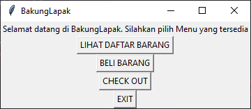
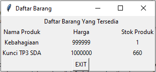
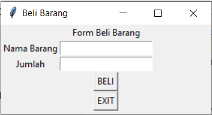
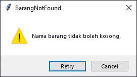
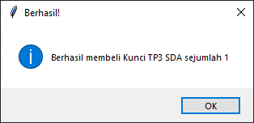
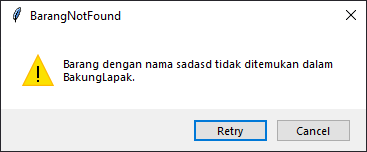
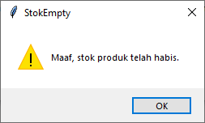
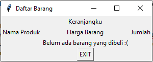
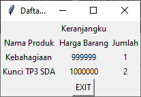

# BakungLapak

    
    Teaching assistant TAN made this.

Setelah Dekdepedia berkembang pesat, Dek Depe akhirnya mempunyai budget yang cukup untuk untuk mempekerjakan tim developer untuk mengembangkan versi GUI dari Dekdepedia. Lalu, karena ingin namanya lebih mudah dikenali oleh masyarakat, Dek Depe mengubah nama perusahaannya menjadi BakungLapak, sebuah perusahaan e-commerce yang terinspirasi dari bunga Bakung. Kali ini, kamu tergabung di divisi development yang bertugas mengembangkan tampilan GUI dan event-driven programming untuk BakungLapak. Tenang saja, sudah ada rekan back-end yang mengerjakan sistem dan kamu hanya bertugas untuk membuat aplikasi GUI untuk pembeli dengan template yang disediakan.

---

Untuk memudahkan pengerjaan, telah disediakan template yang berisi class dan object yang dibutuhkan dan kerangka pengerjaan GUI. Template dapat diakses [di sini](template.py).

## Spesifikasi

Program GUI terdiri dari satu window utama sebagai main menu. Berikut contoh tampilannya!

Terdapat 4 tombol yang dapat digunakan:

1. DAFTAR BARANG  
   Menampilkan window baru yang berisi daftar barang dengan keterangan sebagai berikut:

    - Nama barang
    - Harga: harga untuk 1 buah barang.
    - Stok: ketersediaan barang di pasaran.

    Untuk mempermudah pengerjaan, telah disediakan daftar barang yang tersedia dan logic yang dibutuhkan pada template. Kamu bebas untuk mengubah isi daftar barang untuk debugging dan asisten dosen bebas untuk memeriksa program dengan daftar barang yang berbeda.

    Window harus menampilkan **seluruh barang** beserta keterangannya, termasuk yang stoknya bernilai 0. Informasi setiap barang disajikan dalam suatu tabel. Berikut ini adalah contoh tampilannya!

    

    > Gunakan grid untuk memudahkan penyusunan tabel. Kamu dapat berkreasi untuk mempercantik tampilan tabel selama tetap menampilkan seluruh informasi.

    Terakhir, sediakan tombol bernama EXIT untuk menutup window daftar barang.

2. BELI  
   Menampilkan window baru yang didalamnya terdapat 2 tempat untuk memasukkan input, dimana input pertama untuk input nama barang dan input kedua untuk input jumlah barang yang ingin dibeli. Input jumlah dipastikan merupakan bilangan angka. Berikut adalah contoh tampilannya!

    

    Tombol beli berfungsi sebagai trigger untuk mensubmit data dan sediakan juga tombol bernama EXIT untuk menutup window daftar barang.

    Kalau input nama barang berupa string kosong tampilkan popup message seperti berikut:

    

    jika user memilih retry, window beli tidak perlu ditutup. Jika user memilih cancel, window beli HARUS ditutup.

    Kalau barang berhasil dibeli tampilkan popup message seperti berikut:

    

    Kalau barang tidak ditemukan tampilkan popup message seperti berikut:

    

    Jika user memilih retry, window beli tidak perlu ditutup. Jika user memilih cancel, window beli HARUS ditutup.

    Kalau stok barang sudah habis tampilkan popup message seperti berikut:

    

    **BEHAVIOR:** Jika barang berhasil dibeli, Textfield dikosongkan. Akan tetapi, jika stok habis atau barang tidak ada, tidak perlu mengosongkan Textfield.

3. CHECKOUT (tidak wajib)  
   Menampilkan window yang berisi riwayat pembelian dengan keterangan sebagai berikut:

    - Nama barang
    - Harga
    - Jumlah pembelian

    Window harus menampilkan seluruh barang yang dibeli. Apabila belum ada barang yang dibeli, tampilkan “Belum ada barang yang dibeli :(“. Jika membeli barang yang sama, tidak perlu menambah item pada tabel, cukup tambahkan di jumlah yang dibeli saja. Terakhir, sediakan tombol bernama EXIT untuk menutup window daftar barang checkout.

    Tampilan ketika belum ada barang yang dibeli:

    

    Tampilan ketika sudah ada barang yang dibeli:

    

4. EXIT  
   Keluar dari program.

Catatan:  
Kamu bebas untuk memberikan kreasi pada tampilan GUI yang ditampilkan, tetapi letak semua tombol di semua window dan susunan daftar pada menu Checkout dan Daftar Barang tidak boleh diubah.
